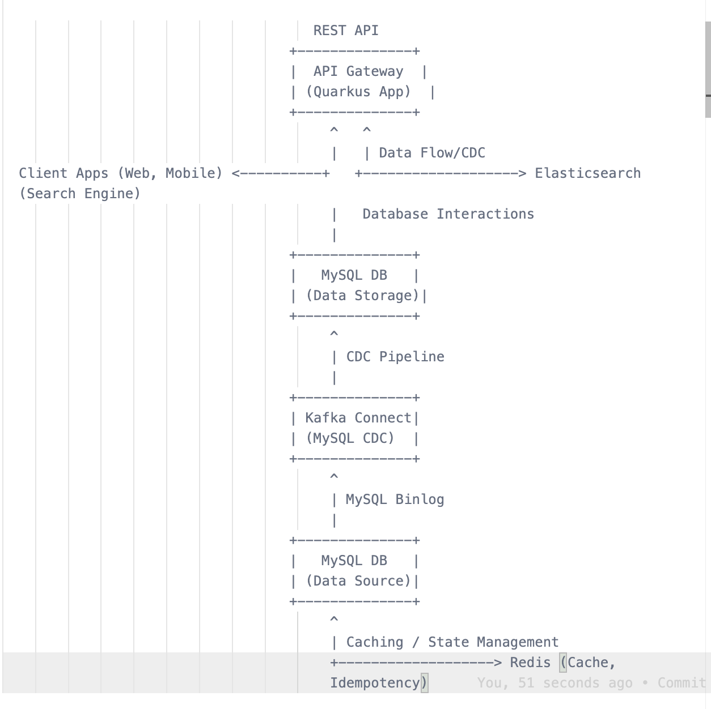

# Hotel Booking Integration Service - API Gateway

## Project Description

This project implements an API Gateway for a Hotel Booking Integration Service. It provides core functionalities for searching, creating, updating, viewing, and canceling hotel bookings. The service is designed to handle a high volume of booking requests and incorporates key backend engineering principles for scalability, performance, resilience, and security.

## Key Features

*   **Hotel Search:** Allows users to search for hotels based on keywords using Elasticsearch for fast and relevant results.
*   **Booking Management:**
    *   **Create Booking:** Creates new hotel bookings with capacity validation to prevent overbooking.
    *   **Update Booking:** Modifies existing booking details.
    *   **View Booking:** Retrieves booking information by ID.
    *   **Cancel Booking:** Cancels existing bookings.
*   **Capacity Management:** Ensures hotel capacity is not exceeded when creating bookings, preventing overbooking through transactional checks.
*   **Elasticsearch Integration:** Utilizes Elasticsearch for efficient and scalable hotel searching. Booking data is CDC-synced to Elasticsearch for searchability.
*   **Idempotency:** Implements idempotency for booking creation and update operations using Redis to handle duplicate requests safely.
*   **API Documentation:**  Provides comprehensive API documentation using OpenAPI and Postman Collection
*   **Instrumentation and Monitoring:** Includes basic instrumentation with:
    *   **Metrics:** Exposed via Prometheus endpoint `/metrics` (using `quarkus-micrometer` and `quarkus-micrometer-registry-prometheus`). Key metrics include request counts, latency, and error rates.
    *   **Logging:** Comprehensive logging using Logstash for debugging and auditing.
    *   **Tracing:** Distributed tracing with Jaeger for request flow analysis.
*   **Input Validation:** Implements basic XSS input validation using jsoup to enhance API security.
*   **Dockerized Deployment:**  Easily deployable and runnable using Docker Compose, including all necessary dependencies (MySQL, Elasticsearch, Redis, Kafka, Monitoring stack).
*   **Race Condition Handling:** Implements Serializable transactions and Pessimistic Locking to prevent race conditions during booking creation and ensure data consistency.

## Technology Stack

*   **Backend Framework:** Quarkus (Java, Reactive)
*   **Database:** MySQL (Relational Database for persistent data storage)
*   **Search Engine:** Elasticsearch (for hotel search functionality)
*   **Cache & Idempotency:** Redis (for API response caching and idempotency key storage)
*   **Message Queue/Data Streaming (CDC):** Kafka, Kafka Connect (for Change Data Capture from MySQL to Elasticsearch)
*   **API Documentation:** OpenAPI, Postman Collection
*   **Metrics & Monitoring:** Micrometer, Prometheus, Grafana
*   **Tracing:** OpenTelemetry, Jaeger
*   **Build Tool:** Maven
*   **Containerization & Orchestration:** Docker, Docker Compose
*   **Language:** Java

## System Architecture (High-Level)

The system follows a microservice-inspired architecture, with the API Gateway acting as the central entry point for client requests and orchestrating interactions with various backend services.



## Running the Application

**Prerequisites:**

*   [Docker](https://www.docker.com/get-started) and [Docker Compose](https://docs.docker.com/compose/install/) installed on your system.

**Steps:**

1.  **Clone the repository:**
    ```bash
    git clone https://github.com/ccdlvc/hrs-assessment.git hrs-assessment
    cd hrs-assessment
    ```

2.  **Start the application and dependencies using Docker Compose:**
    ```bash
    docker-compose up --build
    ```
    This command will:
    *   Build the Docker image for the `api-gateway` service.
    *   Start all services defined in `docker-compose.yml` (API Gateway, MySQL, Elasticsearch, Redis, Kafka, Kafka Connect, Prometheus, Grafana, Jaeger).
    *   Run the application in Docker containers.

3.  **Access the API:**

    *   **API Gateway:** Accessible at `http://localhost:8080`
    *   **OpenAPI (API Documentation):** Browse API documentation and test endpoints at `http://localhost:8080/q/openapi/`
    *   **Grafana Dashboard (Monitoring):** Access Grafana dashboards for metrics visualization at `http://localhost:3000` (default credentials: admin/hrs.com)
    *   **Jaeger UI (Tracing):** Explore distributed traces at `http://localhost:16686`
    *   **Kafka UI:** Access Kafka UI for topic and message inspection at `http://localhost:8081`

4.  **Stop the application and dependencies:**
    ```bash
    docker-compose down
    ```

## API Endpoints

The API Gateway exposes the following REST API endpoints for hotel booking management:

**Hotel API (`/api/v1/hotels`)**

*   `GET /api/v1/hotels/search?query={keywords}`: Search hotels by keywords (Elasticsearch).
*   `POST /api/v1/hotels`: Create a new hotel.
*   `GET /api/v1/hotels/{id}`: Get hotel details by ID.
*   `PUT /api/v1/hotels/{id}`: Update hotel information.
*   `DELETE /api/v1/hotels/{id}`: Delete a hotel.

**Booking API (`/api/v1/bookings`)**

*   `GET /api/v1/bookings/search?userId={userId}&hotelId={hotelId}&checkinDate={checkinDate}&checkoutDate={checkoutDate}`: Search bookings by criteria using Elasticsearch.
*   `GET /api/v1/bookings/user/{userId}`: Get bookings for a specific user.
*   `GET /api/v1/bookings/hotel/{hotelId}`: Get bookings for a specific hotel.
*   `POST /api/v1/bookings`: Create a new booking.
*   `GET /api/v1/bookings/{id}`: Get booking details by ID.
*   `PUT /api/v1/bookings/{id}`: Update booking information.
*   `DELETE /api/v1/bookings/{id}`: Cancel a booking.

**Request and Response Formats:**

All API endpoints use JSON for request and response bodies and follow standard REST principles. Refer to the OpenAPI and Postman documentation for detailed request/response schemas and examples.

Instrumentation and Monitoring
The application is instrumented with:

Metrics: Exposed via Prometheus endpoint /metrics (using quarkus-micrometer and quarkus-micrometer-registry-prometheus). Key metrics include request counts, latency, and error rates. View dashboards in Grafana at http://localhost:3000.

Logging: Comprehensive logging using SLF4J at DEBUG level (configured in application.properties). Logs are output to the console and can be aggregated and analyzed using a logging system in a production environment.

Tracing: Distributed tracing implemented using OpenTelemetry and Jaeger (using quarkus-opentelemetry and quarkus-opentelemetry-exporter-jaeger). Traces can be viewed in Jaeger UI at http://localhost:16686 to track requests across the API Gateway and backend services.

Scalability and Performance Considerations
The API Gateway is designed for scalability and performance by incorporating the following principles:

Horizontal Scalability: The Quarkus application is designed to be stateless and can be horizontally scaled by running multiple instances behind a load balancer. Docker Compose and Kubernetes (for production) facilitate easy scaling.

Asynchronous and Non-blocking I/O: Quarkus framework is reactive and uses non-blocking I/O to handle concurrent requests efficiently.

Caching: Redis is used for server-side caching of API responses and hotel data to reduce latency and backend load.

Database Indexing: Indexes are defined on frequently queried columns in MySQL tables (e.g., hotel_id, user_id in bookings table) to optimize database query performance.

Serializable Transactions: Serializable isolation level is used for booking creation transactions to ensure data consistency and prevent race conditions, especially during capacity checks.

Security Considerations
Basic security measures implemented in this project include:

Input Validation: XSS input validation is implemented using jsoup to sanitize and reject potentially malicious input in API requests, preventing basic Cross-Site Scripting (XSS) attacks. ValidationHelper utility class centralizes XSS validation logic.

Idempotency: Idempotency is implemented for booking creation and update operations using the Idempotency-Key header and Redis caching. This ensures that duplicate requests are handled safely and prevent unintended side effects.

HTTPS (Assumed): It is assumed that for production deployments, HTTPS would be enabled for all API communication to ensure secure data transmission and protect sensitive data in transit.

To improve Quarkus Hotel Booking API Gateway to serve 3 million requests per hour using AWS technologies, we need to focus on building a highly scalable, resilient, and performant infrastructure. Here’s a breakdown of AWS technologies and architectural strategies we can leverage, categorized by layer:

1. Entry Point and Traffic Management (API Gateway Layer):

AWS API Gateway: This is the most crucial component for handling high request volumes. Replace your simple load balancer setup with AWS API Gateway.

Scalability and High Availability: API Gateway is a fully managed service designed to handle massive scale and automatically scales to handle millions of requests per hour without you managing infrastructure.

Traffic Management: Features like request throttling, caching, request transformation, and routing are built-in.

Security: Integrates with AWS WAF for protection against common web exploits, supports API authentication and authorization (API keys, IAM roles, Cognito, OAuth 2.0).

Monitoring and Logging: Provides detailed metrics, logging, and tracing integrated with Amazon CloudWatch and X-Ray.

Caching: Implement API Gateway caching to cache responses at the edge, reducing latency and backend load for frequently accessed data (e.g., hotel details, search results). Configure appropriate cache TTLs.

AWS CloudFront (Content Delivery Network - CDN):

Edge Caching: Use CloudFront to cache API responses (especially GET requests like hotel searches, hotel details) closer to users globally. This drastically reduces latency for geographically distributed users and offloads traffic from your API Gateway and backend.

Static Content Delivery: If API Gateway serves any static content (like Swagger UI files, images, etc.), CloudFront can efficiently serve this content.

AWS Global Accelerator (Optional, for Global Performance):

Global Routing and Acceleration: If users are globally distributed, consider AWS Global Accelerator to route traffic to the optimal API Gateway endpoint based on user location and network conditions, further improving latency and availability.

2. Compute Layer (API Gateway Application Instances):

Amazon ECS (Elastic Container Service) or AWS Fargate (Serverless Compute for Containers):

Scalable Deployment: Deploy containerized API Gateway on ECS or Fargate.

ECS: Provides more control over the underlying EC2 instances and cluster management.

Fargate: Serverless compute engine for containers. We don't manage EC2 instances; AWS manages the underlying infrastructure. Fargate is simpler to operate and scales automatically.

Horizontal Scaling: ECS/Fargate allows we to easily scale out your API Gateway by increasing the number of container instances.

Auto Scaling (for ECS/Fargate):

Dynamic Scaling: Configure Auto Scaling for your ECS/Fargate service to automatically adjust the number of API Gateway instances based on real-time traffic load (CPU utilization, request latency, request count, etc.). This ensures API Gateway can dynamically scale up during peak hours and scale down during low traffic periods, optimizing resource utilization and cost.

Elastic Load Balancer (ALB - Application Load Balancer):

Traffic Distribution: Use an Application Load Balancer (ALB) in front of ECS/Fargate container instances. ALB will distribute incoming traffic evenly across your API Gateway instances, ensuring high availability and load distribution.

Health Checks: ALB automatically performs health checks on API Gateway instances and routes traffic only to healthy instances, improving resilience.

3. Data Storage Layer (Database, Cache, Search Engine):

Amazon Aurora (MySQL-Compatible or PostgreSQL-Compatible) or Amazon RDS for MySQL:

Managed Relational Database: Migrate MySQL database to a managed service like Amazon Aurora (MySQL-compatible or PostgreSQL-compatible) or Amazon RDS for MySQL. These services provide:

Scalability: Easily scale database resources (compute, storage, IOPS) as data volume and traffic grow.

High Availability: Built-in features for high availability, replication, backups, and disaster recovery.

Performance: Optimized for performance and high throughput.

Reduced Operational Overhead: AWS manages database infrastructure, backups, patching, and maintenance, reducing your operational burden.

Connection Pooling (in Application): Ensure your Quarkus application uses efficient database connection pooling (Quarkus Datasource handles this by default) to minimize connection overhead and improve database interaction performance.

Read Replicas (for Read-Heavy Workloads): If API is very read-heavy (e.g., frequent hotel searches, viewing hotel details), consider using Aurora Read Replicas or RDS Read Replicas to offload read traffic from the primary database instance, improving read scalability and performance.

Amazon ElastiCache (Redis):

Managed Redis Service: Migrate self-managed Redis instance to Amazon ElastiCache for Redis. ElastiCache provides:

Scalability and Clustering: Easily scale Redis cache cluster horizontally and vertically. ElastiCache supports Redis Cluster for distributed caching.

High Availability: Managed Redis with replication and automatic failover for high availability.

Reduced Operational Overhead: AWS manages Redis infrastructure, backups, patching, and monitoring.

Optimize Caching Strategies: Implement effective caching strategies at different layers (CDN, API Gateway, Service Layer - as discussed previously). Use appropriate cache TTLs and cache invalidation mechanisms to balance performance and data consistency.

Amazon OpenSearch Service (Managed Elasticsearch):

Managed Elasticsearch: Migrate your self-managed Elasticsearch instance to Amazon OpenSearch Service (successor to Amazon Elasticsearch Service). OpenSearch Service provides:

Scalability and Reliability: Managed Elasticsearch service designed for scalability, reliability, and high performance.

Simplified Management: AWS manages Elasticsearch infrastructure, scaling, backups, and maintenance.

Integration with AWS: Seamlessly integrates with other AWS services like CloudWatch, IAM, and more.

4. Monitoring and Observability (AWS CloudWatch, X-Ray):

Amazon CloudWatch Metrics:

Comprehensive Metrics Collection: Utilize Amazon CloudWatch to collect detailed metrics for all AWS services you are using (API Gateway, ECS/Fargate, RDS, ElastiCache, OpenSearch Service, etc.).

Key Metrics to Monitor:

API Gateway: Request count, latency, error rates, throttling counts, cache hit/miss rates.

ECS/Fargate: CPU utilization, memory utilization, network I/O, task counts.

RDS/Aurora: CPU utilization, database connections, query latency, IOPS, storage usage.

ElastiCache: Cache hit rate, miss rate, latency, memory usage, connection counts.

OpenSearch Service: Cluster health, indexing rate, query latency, resource utilization.

CloudWatch Dashboards and Alarms: Create CloudWatch dashboards to visualize key metrics and set up CloudWatch alarms to automatically notify you of performance degradation, errors, or exceeding thresholds.

AWS X-Ray (Distributed Tracing):

End-to-End Request Tracing: Use AWS X-Ray to implement distributed tracing for your API requests. X-Ray allows you to trace requests as they flow through your API Gateway and backend services, helping you identify performance bottlenecks and understand request flows in a distributed environment.

Visualize Request Flows: X-Ray provides visualizations of request traces, showing latency breakdowns for each component involved in handling a request. This is invaluable for performance analysis and debugging.

Centralized Logging with Amazon CloudWatch Logs:

Aggregate Logs: Configure your Quarkus application, API Gateway, ECS/Fargate containers, and other AWS services to send logs to Amazon CloudWatch Logs.

Centralized Log Management: CloudWatch Logs provides a central place to store, search, filter, and analyze logs from all your application components.

Log Analysis and Dashboards: Use CloudWatch Logs Insights to query and analyze logs, create dashboards, and set up alerts based on log patterns or error rates.

5. Deployment and Infrastructure as Code (IaC):

AWS CloudFormation or AWS CDK (Cloud Development Kit):

Infrastructure as Code (IaC): Use CloudFormation or CDK to define your entire AWS infrastructure (API Gateway, ECS/Fargate, RDS, ElastiCache, OpenSearch Service, Load Balancers, Monitoring setup, etc.) as code.

Automated Provisioning: IaC enables you to automate the provisioning and deployment of your infrastructure, making it repeatable, version-controlled, and easier to manage and scale.

Consistency and Repeatability: IaC ensures consistent infrastructure deployments across different environments (development, staging, production).

CI/CD Pipelines (AWS CodePipeline, AWS CodeBuild, AWS CodeDeploy):

Automated Build, Test, and Deployment: Implement CI/CD pipelines using AWS CodePipeline, CodeBuild, and CodeDeploy to automate the entire software delivery process, from code commit to deployment to AWS infrastructure.

Continuous Integration and Continuous Delivery: CI/CD pipelines enable faster and more reliable software releases, automated testing, and streamlined deployments.

Summary of AWS Technologies for 3 Million Requests/Hour:

API Gateway: AWS API Gateway (Essential for Entry Point, Scalability, Management, Security)

Compute: AWS Fargate (Recommended for Simplicity and Scalability) or ECS with Auto Scaling

Database: Amazon Aurora (MySQL or PostgreSQL Compatible) or Amazon RDS for MySQL (Managed, Scalable, HA Relational Database)

Cache: Amazon ElastiCache (Redis) (Managed, Scalable, HA Caching Service)

Search Engine: Amazon OpenSearch Service (Managed, Scalable Elasticsearch)

Monitoring: Amazon CloudWatch (Metrics, Logs, Alarms), AWS X-Ray (Distributed Tracing)

Deployment & IaC: AWS CloudFormation or AWS CDK (Infrastructure as Code), AWS CodePipeline/CodeBuild/CodeDeploy (CI/CD)

CDN (Optional but Recommended): AWS CloudFront (Content Delivery Network for Caching at the Edge)

Security (Essential): AWS WAF (Web Application Firewall), API Gateway Security Features (Authentication, Authorization), HTTPS
